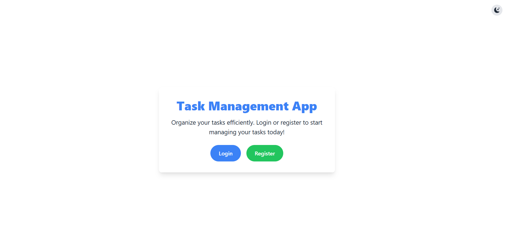
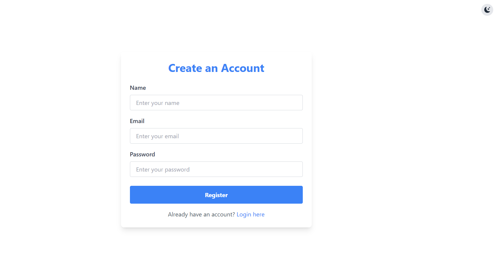
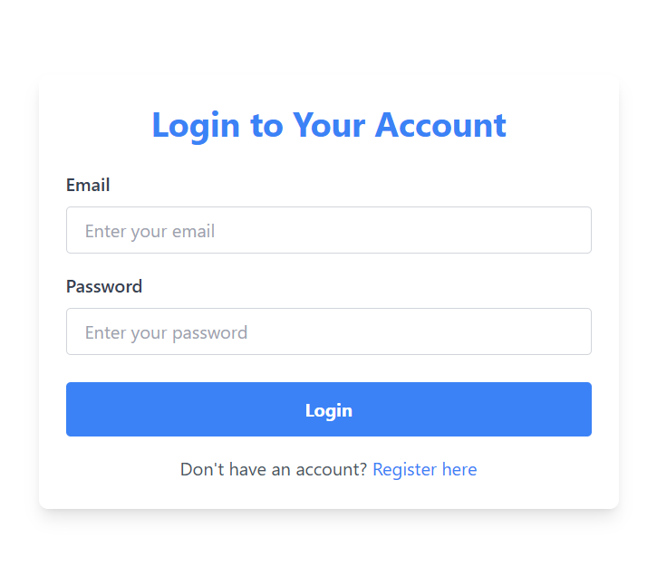
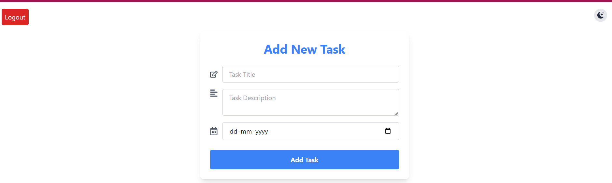
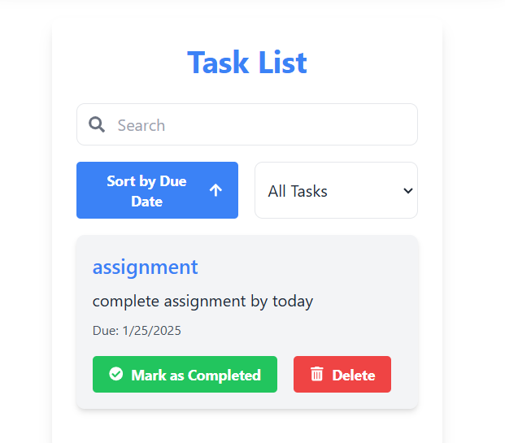
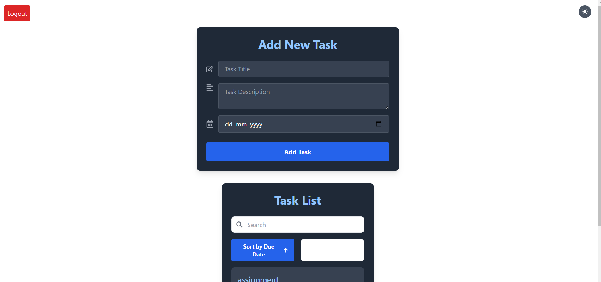

# Task Management Application

## Description
The **Task Management Application** is a robust tool designed to streamline task management and enhance productivity. With its user-friendly interface, users can:

- Create, update, and delete tasks.
- Track progress and mark tasks as complete.

This project utilizes a **React frontend** and a **Node.js backend** with **MongoDB** as the database. The backend is deployed on Render, and the frontend is designed for seamless user interaction.

---

## Features
- **Task Creation**: Add new tasks with details such as title, description, and deadlines.
- **Task Management**: Update, delete, or reorganize tasks.
- **Progress Tracking**: View and track task completion.
- **Responsive Design**: Works across desktop and mobile devices.
- **Backend API Integration**: Communicates with a secure Node.js backend.

---

## Setup and Run Locally

Follow these steps to set up and run the project on your local machine:

### Prerequisites
1. Node.js (v16 or later)
2. npm or yarn
3. MongoDB (local or Atlas instance)

### Frontend Setup
1. Clone the repository:
   ```bash
   git clone https://github.com/EshaDhoot/TaskManagement_FrontEnd.git
   cd TaskManagement_FrontEnd

2. Install dependencies:
   ```bash
   npm install

3. Create a .env file in the root of the frontend project and add the following:
    ```bash
    REACT_APP_BASE_URL=http://localhost:5000/api/v1

4. Start the frontend development server:
    ```bash
    npm start



















